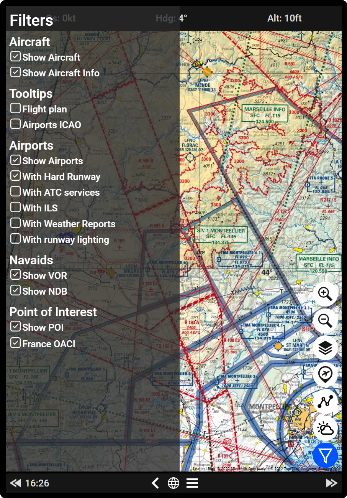
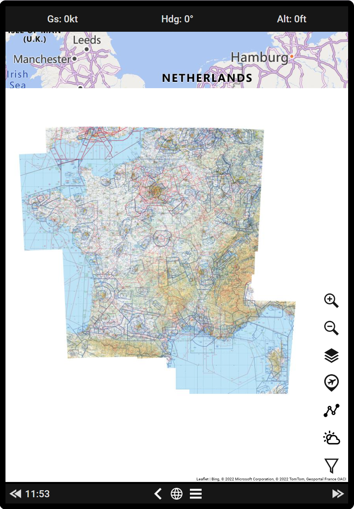
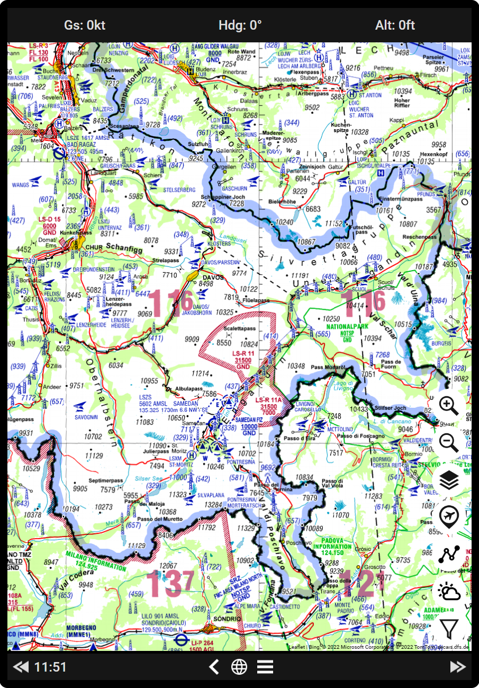
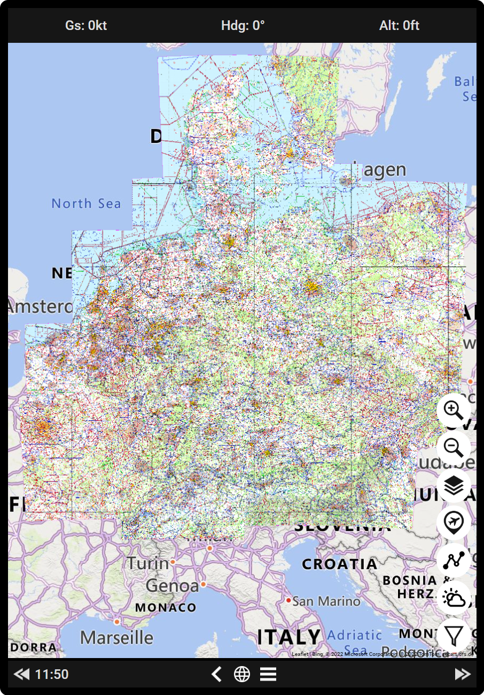
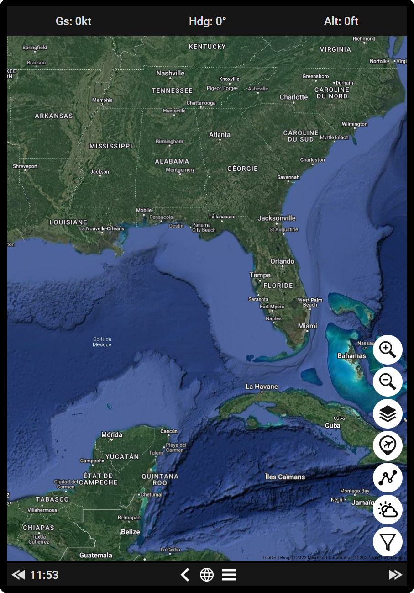
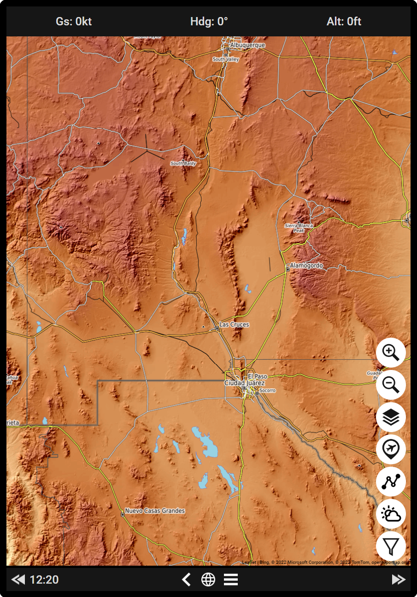
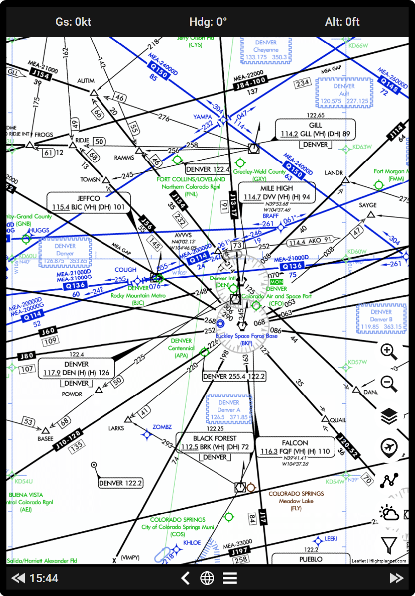
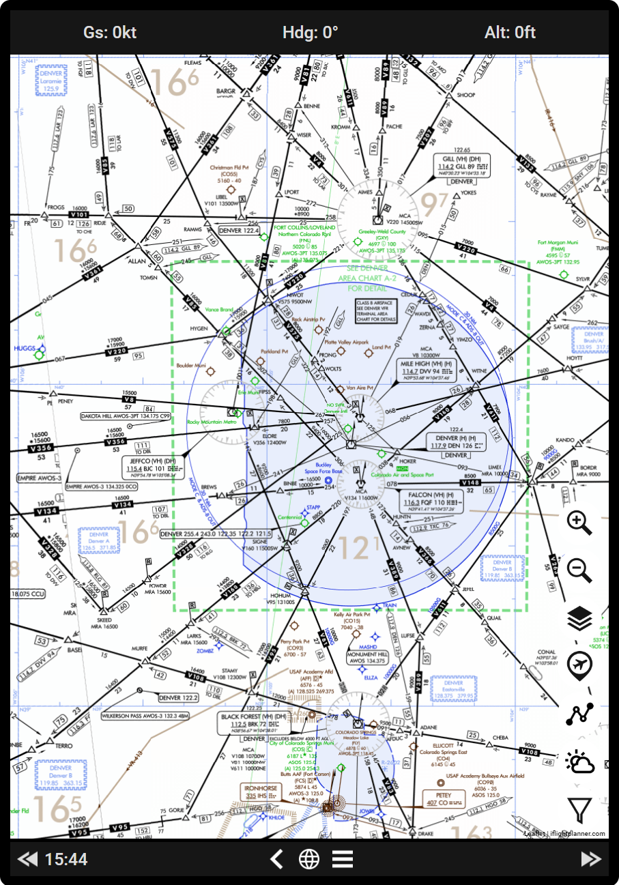
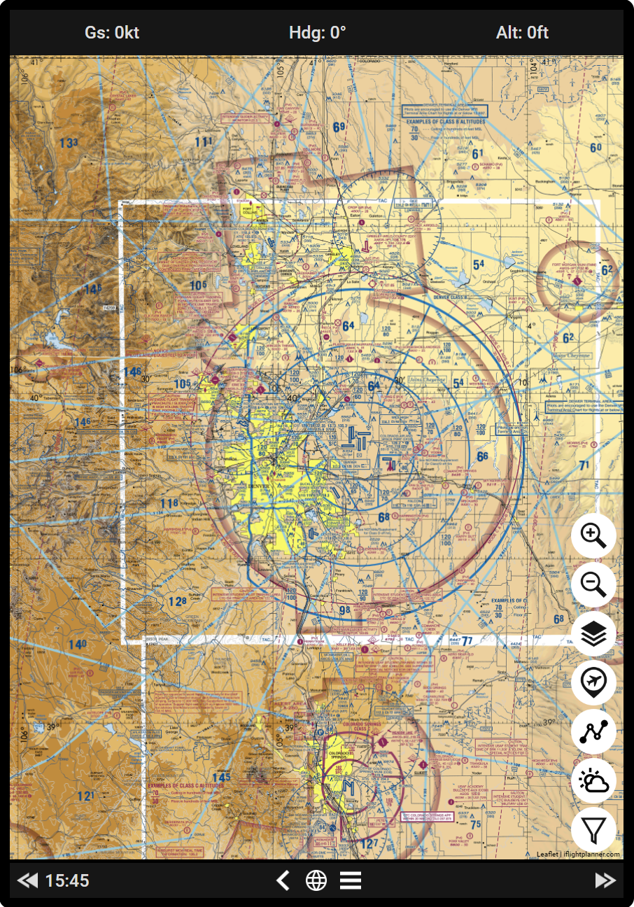

# Sky4Sim-Pad-Map-Addons
New maps layers for Sky4Sim Pad: This is only compatible with Sky4Sim NG version 1.5.1.6 and greater!

# Special words
Thanks to the sky4sim creator for the addons.js integration into sky4sim NG!

# Installation
# Sky4Sim NG - from version 1.5.1.7:
Copy the content of the maps you want to enable in: [Sky4Sim root directory]/MSFSPad/js/addons.js
Backup the file in case it gets overwritten by an update!

The new maps will shows on the filter panel available from the map button!

# Available maps
# France OACI
details:

area:

# DSF-Fligtmap
details:

area:

# Google Map Aerial

# OpenTopoMap

# US IFR High

# US IFR Low

# US Sectional
